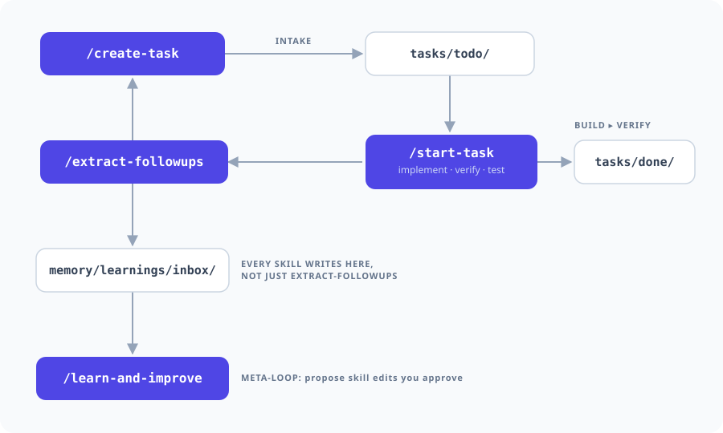

# agentic-loop

A small, runnable loop of AI coding-agent skills that improves itself. Clone it, point it
at your project, and drive real work through a cycle that plans, builds, verifies, and
learns from its own mistakes, with a human in the loop at every turn.

This is a GitHub template. Press **Use this template**, drop in your own project, and adapt
the six skills.

> Six markdown skills, one loop. No framework to install, nothing to configure. The skills
> are written for [Claude Code](https://docs.claude.com/en/docs/claude-code) as drop-in
> slash-commands in `.claude/commands/`, but the patterns are agent-agnostic. Adapt the
> invocation to whatever coding agent you run.

## The loop

<p align="center">
  
</p>

The point is not any single skill. It is that they compose into a workflow that is:

- **self-orienting** - `/next` is a conductor. Run it and it tells you where you are in
  the cycle and the one command to run next. The workflow is legible instead of tribal.
- **self-verifying** - `/start-task` does not trust its own first pass. It ends with an
  independent, fresh-context review that reads the diff against the spec and catches where
  the agent is confidently wrong, plus a test run that has been watched to *fail* before it
  is believed - because the failure mode in practice is not a red suite, it is a green one
  over a live bug. "Done" is earned, not asserted.
- **self-improving** - `/learn-and-improve` reads the mistakes the loop recorded, finds
  the recurring ones, and proposes edits to the skills' own instructions. You approve each
  one. The system gets less wrong over time without ever removing the human from the call.
  Fixes that are not specific to your project it offers to push back to the template you
  started from, so the lesson reaches the next project too instead of dying in this repo.
- **self-updating** - `/sync-template` brings later template improvements back down, reviewing
  each one against what you have already changed locally. It is not a `git pull`: your copy has
  diverged on purpose, so every incoming change is adopted, adapted, or refused, and the
  decision is written into `project/TEMPLATE-SYNC.md`. A refusal is recorded, so it is never
  re-offered - which is what keeps the two directions from fighting each other.

## The six skills

| Skill | What it does |
|-------|--------------|
| [`/next`](.claude/commands/next.md) | The conductor. Orients you and names the next command. Start here. |
| [`/create-task`](.claude/commands/create-task.md) | Turns a rough request into one self-contained task file. |
| [`/start-task`](.claude/commands/start-task.md) | Implements a task, then verifies it with a fresh-eyes review and tests. |
| [`/extract-followups`](.claude/commands/extract-followups.md) | Routes the follow-ups and concerns a task surfaced back into the queue. |
| [`/learn-and-improve`](.claude/commands/learn-and-improve.md) | The meta-loop. Turns recorded mistakes into proposed skill edits you approve, and offers the portable ones back to the template. |
| [`/sync-template`](.claude/commands/sync-template.md) | Pulls the template's later improvements in, one at a time, without wiping what you changed locally. |

## Adding a new skill

The six above are the core cycle, not the ceiling. When a job keeps recurring - here or in
a project cloned from this template - and deserves its own skill rather than being redone
from scratch each time, run `/create-skill`. It writes the new skill in the same shape as
the six: numbered steps, a closing rationale, and the same "log anything that went sideways"
step every skill here now ends with. See [`ADAPTING.md`](ADAPTING.md) for when to reach for
it instead of `/learn-and-improve`.

## Quickstart

1. **Use this template** on GitHub, then clone your copy.
2. Open [`project/CONTEXT.md`](project/CONTEXT.md) and describe your codebase: what it is,
   where the code lives, and the command that runs its tests. This is the one placeholder
   the skills read to know what they are working on.
3. Open the repo in Claude Code (or your agent of choice) and run the conductor:

   ```
   /next
   ```

   It reads the queue, tells you that you are at intake, and hands you the next command.
4. Create your first task, then build it:

   ```
   /create-task "add an unread-count badge to the header nav"
   /start-task
   ```
5. When a task finishes, close the loop and let the system learn:

   ```
   /extract-followups
   /learn-and-improve      # once a few learnings have accumulated
   ```

A worked example task ships in [`tasks/todo/`](tasks/todo/) so you can watch one flow
through the loop before writing your own.

6. Fill in [`project/TEMPLATE-SYNC.md`](project/TEMPLATE-SYNC.md) with the commit you cloned
   from. That is what lets `/sync-template` bring later improvements to these skills into your
   copy without trampling the edits you have made in the meantime — and it is much easier to
   set now than to reconstruct in six months.

## What is where

```
.claude/commands/   the six skills (the whole system)
project/CONTEXT.md   >>> describe your project here (the main placeholder) <<<
project/TEMPLATE-SYNC.md   how far you have synced with this template, and what you refused
tasks/todo|doing|done   the task queue the loop moves work through
memory/learnings/    recorded mistakes, one file each, drained by /learn-and-improve
```

## The companion: agentic-memory

This loop verifies and improves; past `memory/learnings/`, it does not remember on its own.
[**agentic-memory**](https://github.com/hh21st/agentic-memory) is the sibling repo that adds the
third pillar: four skills (`/capture`, `/index`, `/recall`, `/distill`) over a folder of plain
notes, so the facts a session learns about your project survive past the session that learned
them. Run either on its own, or both together for one story: agents that verify, improve, and
remember themselves, with a human approving every step.

## Adapting it

See [`ADAPTING.md`](ADAPTING.md) for how to tune the skills to your stack, wire them to a
different agent, or extend the loop. The skills are deliberately short so they are easy to
read and change: they are a starting point, not a black box.

## Roadmap

A fuller **evals** layer is the next addition: scoring skill outputs against small rubrics
so improvements to the skills can be measured, not just felt. It is deliberately out of the
first version to keep the loop small and legible.

## Who made this

I build agentic AI systems: multi-agent workflows that implement, review, and verify real
software under human oversight. This template is a clean, minimal version of a loop I use in
my own work. The engineering that matters in agentic AI is not the model, it is the loop
around it: context, orchestration, verification, and safe autonomy.

Fittingly, this repo was itself built with a more evolved version of this same loop. The
work was drafted as tasks, implemented, and then gated by the two-stage fresh-eyes review
you see in start-task, with me approving each step. What you are reading is the distilled
core of that larger system.

Hamid Heydarian — [LinkedIn](https://www.linkedin.com/in/hamid-heydarian-48688b24/).

## License

MIT. See [LICENSE](LICENSE).
